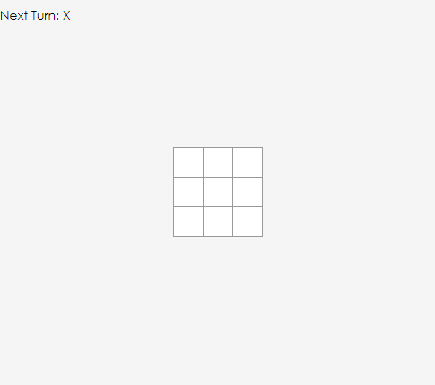

#❌ react-tictactoe ⭕

Simple Tic-Tac-Toe game built using React Hooks

##Getting Started

### `yarn start`

Runs the app in the development mode. 
Open [http://localhost:3000](http://localhost:3000) to view it in the browser.

The page will reload if you make edits. 
You will also see any lint errors in the console

## Information

You can learn more in the [Create React App documentation](https://facebook.github.io/create-react-app/docs/getting-started).

To learn React, check out the [React documentation](https://reactjs.org/).

To learn more check out the [EggHead.io Stream](https://egghead.io/lessons/react-using-react-hooks-to-build-a-tic-tac-toe-game-with-kent-c-dodds?pl=livestreams-13d10dc4).
